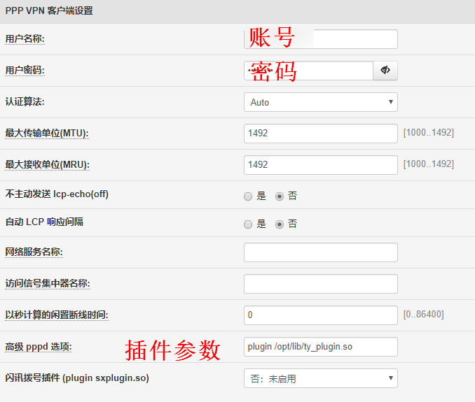

# 天翼飞young3.10 pppd拨号插件
## padavan平台(老毛子固件)

## 使用指南：

1. 用WinSCP上传ty_plugin.so插件到padavan路由器的/tmp目录或者外接 U 盘的/opt 目录下。示例图片中插件被上传至了路由器外接U盘的/opt/lib目录下。
2. 设置padavan路由器的PPPoE拨号界面的“高级 pppd 选项”为：
```
plugin /存放插件的目录/ty_plugin.so
```

3. 填好你的手机号和密码，保存设置拨号即可。



## 注：

#### 兼容：
插件在MTK7620A路由器上测试通过，可正常拨号。其余型号请自测。

#### 防丢失：
请注意，padavan与openwrt不同，除了外接U盘外其所有可写的目录均是在RAM里面，也就是只要重启，所有修改的内容都会丢失。对于没有U盘接口的路由器，上传后再重启就得重新上传。

为了防止插件在重启后丢失，网络提供了这样的一种方法，具体效果请自测：
- 把插件文件上传到路由器的/etc/storage目录
- 弄完之后执行：
  ```
  mtd_storage.sh save
  ```
  系统会把/etc/storage目录下的内容压缩打包,保存进内存中的区块,重启就不消失了。
- 别忘记修改参数中的路径。
